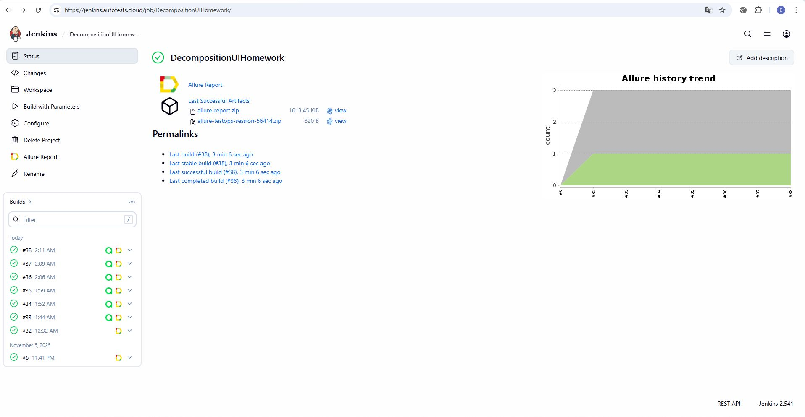
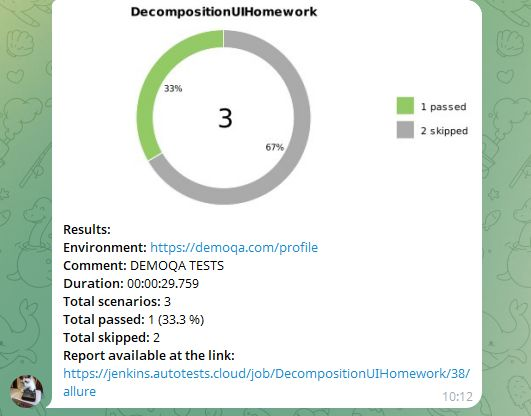

# Проект по автоматизации API для [DemoQa](https://demoqa.com/)
<p align="center">
<a href="https://demoqa.com/"></a>
</p>

## Структура

* <a href="#tools">Стек</a>
* <a href="#cases">Реализованные проверки</a>
* <a href="#console">Запуск из терминала</a>
* <a href="#jenkins">Сборка в Jenkins</a>
* <a href="#allure_TestOps">Интеграция с Allure TestOps</a>
* <a href="#allure">Allure отчет</a>
* <a href="#telegram">Уведомление в Telegram при помощи бота</a>
---

<a id="tools"></a>
## Стек

<p align="center">  
<a href="https://www.java.com/"></a> 
<a href="https://junit.org/junit5/"></a>
<a href="https://rest-assured.io/"></a>
<a href="https://qameta.io/"></a>
<a href="https://allurereport.org/"></a>
<a href="https://selenide.org/"></a> 
<a href="https://aerokube.com/selenoid/"></a> 
<a href="https://gradle.org/"></a> 
<a href="https://www.jenkins.io/"></a> 
<a href="https://web.telegram.org/"></a> 
<a href="https://github.com/"></a> 
<a href="https://www.jetbrains.com/idea/"></a> 
</p>

* В данном проекте автотесты написаны на языке Java.
* В качестве сборщика использован - Gradle.
* Использованы:
  * фреймворки JUnit 5 и Selenide
  * библиотека REST Assured.
* Удаленный прогон тестов запускается в Selenoid.
* Для удаленного запуска реализована джоба в Jenkins с формированием Allure-отчета и отправкой результатов в Telegram при помощи бота.

---
<a id="cases"></a>
## Реализованные проверки
- API:
  - POST /Account/v1/Login - авторизация пользователя
  - POST /Account/v1/User?UserId={UserId} - удаление пользователя
  - DELETE /BookStore/v1/Books?UserId={UserId} - удаление всех книг
  - POST /BookStore/v1/Books - добавление книги
  - DELETE /BookStore/v1/Books?UserId={UserId} - удаление книги
- API + UI:
  - Удаление книги в профиле пользователя
---
<a id="console"></a>
##  Запуск из терминала

Локальный запуск:
```
./gradlew clean test
```
Удаленный запуск:
```
clean test
-DbrowserSize=${BROWSER_SIZE}  
-DremoteUrl=${SELENOID_URL}
```

---
<a id="jenkins"></a>
##  Сборка в Jenkins

[Сборка в Jenkins](https://jenkins.autotests.cloud/job/DecompositionUIHomework)



### Параметры сборки в Jenkins:

* `${BROWSER_SIZE}` - разрешение бразуера. По умолчанию - 1920x1080 - chrome.
* `${SELENOID_URL}` - адрес удаленного сервера Selenoid.

---
<a id="allure_TestOps"></a>
##  Интеграция с Allure TestOps
[Ссылка на Allure TestOps](https://allure.autotests.cloud/launch/50493)

* ### Главный экран запуска


* ### Страница с проведенными тестами


---
<a id="allure"></a>
## Allure отчет
[Allure отчет](https://jenkins.autotests.cloud/job/DecompositionUIHomework/38/allure)

* ### Главный экран отчета


* ### Страница с проведенными тестами


Содержание Allure-отчета:
* Шаги теста
* Скриншот страницы на последнем шаге
* Page Source
* Логи браузерной консоли.

---
<a id="telegram"></a>
##  Уведомление в Telegram при помощи бота



---
